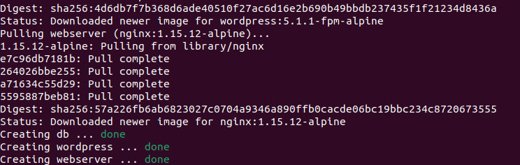

# Операционные системы и виртуализация (Linux)
## Урок 7. Запуск веб-приложения из контейнеров 

Задание:

Установить в виртуальную машину или VDS Docker, настроить набор контейнеров через docker compose по инструкции по ссылке: https://www.digitalocean.com/community/tutorials/how-to-install-wordpress-with-docker-compose-ru. Часть с настройкой certbot и HTTPS опустить, если у вас нет настоящего домена и белого IP.

Результат:

Используем виртуальную машину VirtualBox c Ubuntu 22.04 LTS. Предполагается, что Docker и Docker Compose уже установлены.

### **1. Настройка конфигурации веб-сервера**
* Создаем каталог проекта для настройки WordPress
```
sudo mkdir wordpress && cd wordpress
```
* Создаем каталог для файла конфигурации
```
sudo mkdir nginx-conf
```
* Создаем файл [nginx.conf](resources/nginx.conf)

* Создаем каталог в качестве точки монтирования (если не существует)
```
sudo mkdir -p /var/www/html
```
### **2. Настройка переменных среды**
В основном каталоге ~/wordpress создаем файл [.env](resources/env)

### **3. Определение служб с помощью Docker Compose**
В основном каталоге ~/wordpress создаем файл [docker-compose.yml](resources/docker-compose.yml)

### **4. Запуск**

* Выполняем запуск:

```
sudo docker-compose up -d
```
*Результат:*


* Проверяем список контейнеров:
```
sudo docker-compose ps
```
*Результат:*


* Проверяем работу WordPress по адресу http://10.0.2.15

*Результат:*

